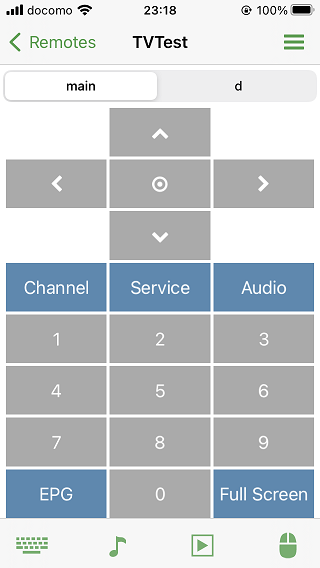
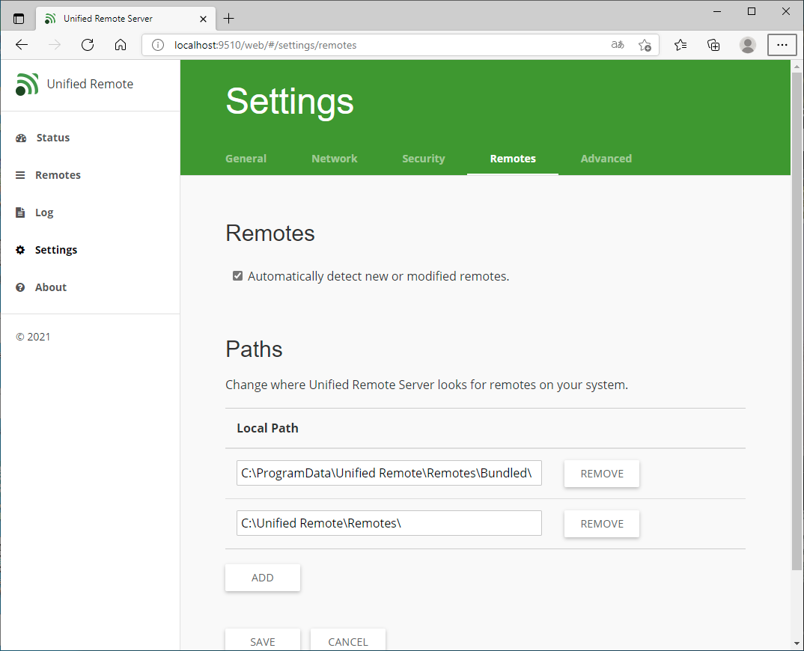
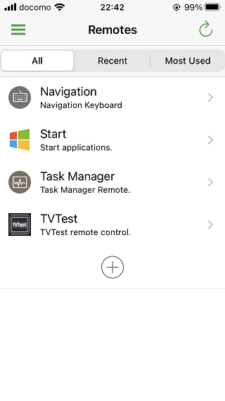
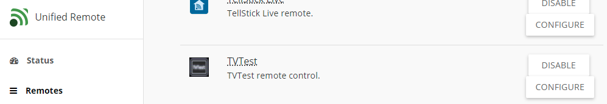
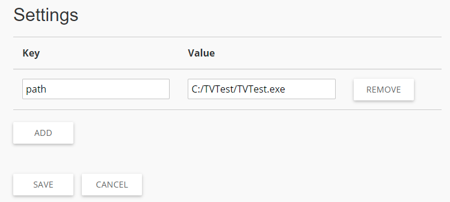

# TVTest Custom Remote for Unified Remote

[Unified Remote](https://www.unifiedremote.com/) 用のCustom Remoteです。スマートフォン等から [TVTest](https://github.com/DBCTRADO/TVTest) を操作できます。



| ボタン | 機能 |
|:-:|-|
| ←→↑↓〇 | カーソルキーおよびEnterキーに相当 |
| 0～9 | 数字キーに相当 |
| Channel | チャンネル選択画面（トグル動作） |
| Service | サービス1～4の切替 |
| Audio | 音声切替 |
| EPG | EPG番組表（トグル動作） |
| Full Screen | 全画面表示（トグル動作） |

## インストール手順（サーバ）

1. Unified RemoteサーバのManagerを起動する。

2. Remotes設定画面で、追加のRemotesパスを登録する。



3. 上で追加したパスへ移動し、下記コマンドを実行する。

```sh
git clone https://github.com/68fpjc/unified-remote-tvtest.git TVTest
```

4. Status画面でRemotesを再読み込みする。

## インストール手順（クライアント）

1. Unified Remoteアプリをインストールし、Custom Remotesを有効化する（iOS、App内課金）。またはUnified Remote Fullアプリをインストールする（Android、有料）。
2. Unified Remoteサーバへ接続する。
3. Remotes画面にTVTestを追加する。



## Tips

### TVTestのパス設定

Unified Remoteサーバ側でKeyに `path` 、ValueにTVTest.exeのフルパスを登録すると、アプリの再生ボタン（▶）でTVTestを起動できます。





## TVTDataBroadcastingWVについて

[TVTDataBroadcastingWV2プラグイン](https://github.com/otya128/TVTDataBroadcastingWV2) に暫定対応しました。

1. TVTestにTVTDataBroadcastingWV2プラグインを導入し、有効化する。プラグイン側はリモコンウィンドウを表示した状態にしておくこと。
2. 「d」タブに切り替えて操作する。


## その他

- アイコンは用意していません。必要な方は、Remoteをインストールしたフォルダにicon.pngを置いてください。
- iOS（iPhone）でのみ動作確認しています。また、TVTestは0.10系でないと動かないかもしれません。
- 個人的によく使う機能のみ実装しています。改造する場合、 [Unified RemoteのGitHub](https://github.com/unifiedremote) が参考になると思います。
- Luaをいじるのは初めてなので、コードがヘボいかもしれません。

以上
